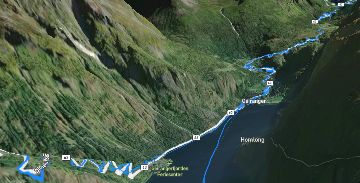
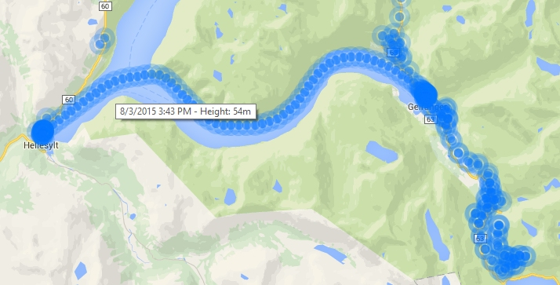
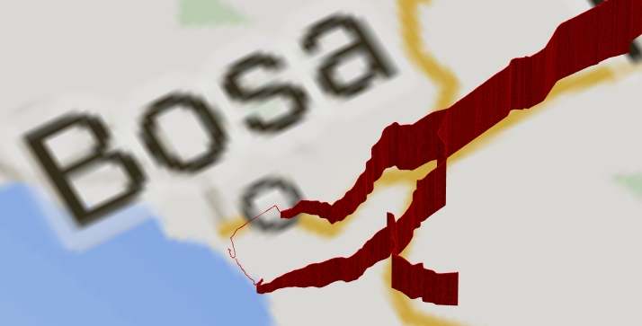

# TrackViewer

Visualize your KML, KMZ, GPX or TCX track in 3D and 2D. Rotate, Tilt and Zoom into your track.

In 2D you can see each recorded position. The tooltip will show you the exact time and height.

## Demo
See https://the-sz.com/products/track_viewer/ for a real life demo.

## 3D MapBox Style

The track is shown on a map from [MapBox](https://www.mapbox.com/). The map can be a street map (`style: trackViewer.style3DMapboxStreetMap`) or a satellite map (`style: trackViewer.style3DMapboxSatellite`).

The map can have 3D terrain or can be flat.
### 3D terrain
`elevation: trackViewer.elevationFromMap` will show a 3D terrain with the track laid onto the terrain.

### Flat map with Elevation from track
`elevation: trackViewer.elevationFromFile` will show a flat map where the track is shown in 3D. The elevation is taken from the track.

### Flat
`elevation: trackViewer.elevationNone` will show a flat map with a flat track.

## 2D Style

The track will be shown on a street map from [Google Maps](https://maps.google.com/). You can decide whether every track record (`style: trackViewer.style2DAllRecords`) or only one record per minute (`style: trackViewer.style2DOneRecordPerMinute`) should be shown as a dot. Using `useLines: true` will connect all dots.

## 3D Style

Track records will be shown in 3D space using bars or `useDots: false` dots. The background can be a Google street map (`style: trackViewer.style3DStreetMap`), a Google satellite map (`style: trackViewer.style3DSatellite`), a blue rectangle (`style: trackViewer.style3DBlueBackground`) or nothing (`style: trackViewer.style3DNoBackground`).

## Examples
[Select](./examples/select.html)
This example shows how to use a track file selected by user from the local computer. It also allows you to select all possible styles.

[Remote](./examples/remote.html)
This example shows how to load track from a server. The track is shown in full window size. The used styles are hard coded.

> Note: You must specify your MapBox access token and Google maps key in the HTML files. Search for \*\*\*KEY\*\*\*.

## Options
### style: trackViewer.style3DMapboxSatellite
In which style the track will be shown.
### elevation: trackViewer.elevationFromMap
How the elevation is shown in the 3D MapBox style.
### useLines: false
Whether the dots in 2D style shown be connected with a line or not.
### useDots: false
Whether the track records should be shown as bars or dots in 3D style.
### mapBoxAccessToken: null
Specify your MapBox access token.
### googleMapsKey: null
Specify your Google maps key.
### domContainer: null
HTML object where the map will be rendered.
### domHeader: null
HTML object which height should be accounted for when resizing the map.
### domFullScreenControl: null
HTML object which will switch to and from full screen in 3D style.
### domInfo: null
HTML object which will be hidden if the track gets shown.
### spacingRight: 25
Number of spacing pixels to the right of the map.
### dotImageLight: 'dotlight.png'
Dot image shown in `trackViewer.style2DAllRecords` style.
### dotImageLightAnchorX: 8
X center of the `dotImageLight` image.
### dotImageLightAnchorY: 8
Y center of the `dotImageLight` image.
### dotImageHeavy: 'dotheavy.png'
Dot image shown in `trackViewer.style2DOneRecordPerMinute` style.
### dotImageHeavyAnchorX: 13
X center of the `dotImageHeavy` image.
### dotImageHeavyAnchorY: 13
Y center of the `dotImageHeavy` image.
### lineColor2D: '#0776FF'
Color of the connecting line in 2D style if `useLines: true`.
### lineColor3DMapBoxElevationFromMap: 'rgba(4, 117, 255, 1.0)'
Track color in 3D MapBox style if `elevation: trackViewer.elevationFromMap` or `elevation: trackViewer.elevationNone`.
### lineColor3DMapBoxElevationFromFile: [4, 117, 255, 255]
Track color in 3D MapBox style if `elevation: trackViewer.elevationFromFile`.

## License
[GNU General Public License v3.0](LICENSE.md)

